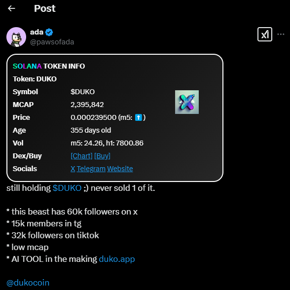

# Solana Token Price & Market Cap Extension

A lightweight Chrome extension that enhances your experience on X (formerly Twitter) by automatically detecting Solana token contract addresses and displaying real-time price and market cap information inline. Always stay updated with the latest release by downloading the packaged extension (`x-solana-token-info.zip`). If using the source code, load the `extension/` subfolder in Developer Mode.

## Features
- Detects Solana contract addresses in posts, especially those ending in `pump` or appearing as `CA: <address>`.
- Fetches and displays live token price and market cap data.
- Provides a quick link to Dexscreener for in-depth chart analysis.
- Seamless integration for a better trading and research experience.

## Installation
1. Download the latest release (`x-solana-token-info.zip`) or clone this repository.
2. Open Chrome and navigate to `chrome://extensions/`.
3. Enable **Developer mode** (toggle in the top right corner).
4. Click **Load unpacked** and select the `extension/` subfolder if using the source code.
5. The extension is now active on X (Twitter)!

## Usage
- Browse X (Twitter) as usual.
- Whenever a Solana contract address appears, the extension will automatically fetch and display token data next to it.
- Click on the provided link to access full charts on Dexscreener.

## Contributing
Contributions, issues, and feature requests are welcome! Feel free to fork the repository and submit pull requests.

## Buy Me a Coffee
Support the project by sending some SOL to: **7MaVRLbjDKcmT4mARt23qhH8uRnqP64anYv89W9gjhcW**

## Feature Requests
Have ideas for new features? Send them to me on X: [x.com/pawsofada](https://x.com/pawsofada)

## License
This project is licensed under the MIT License.

